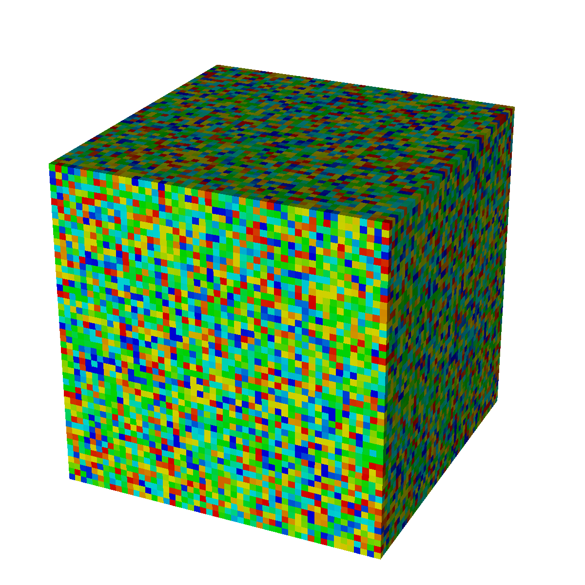
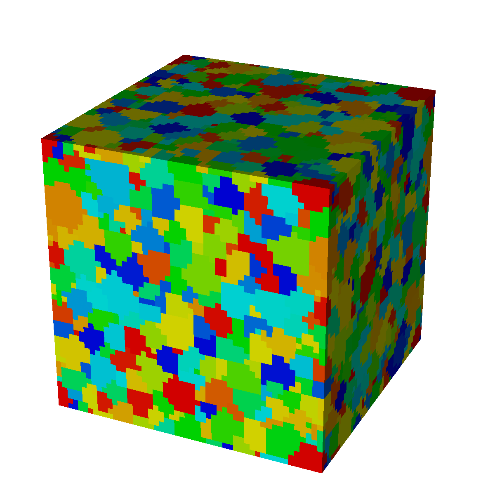
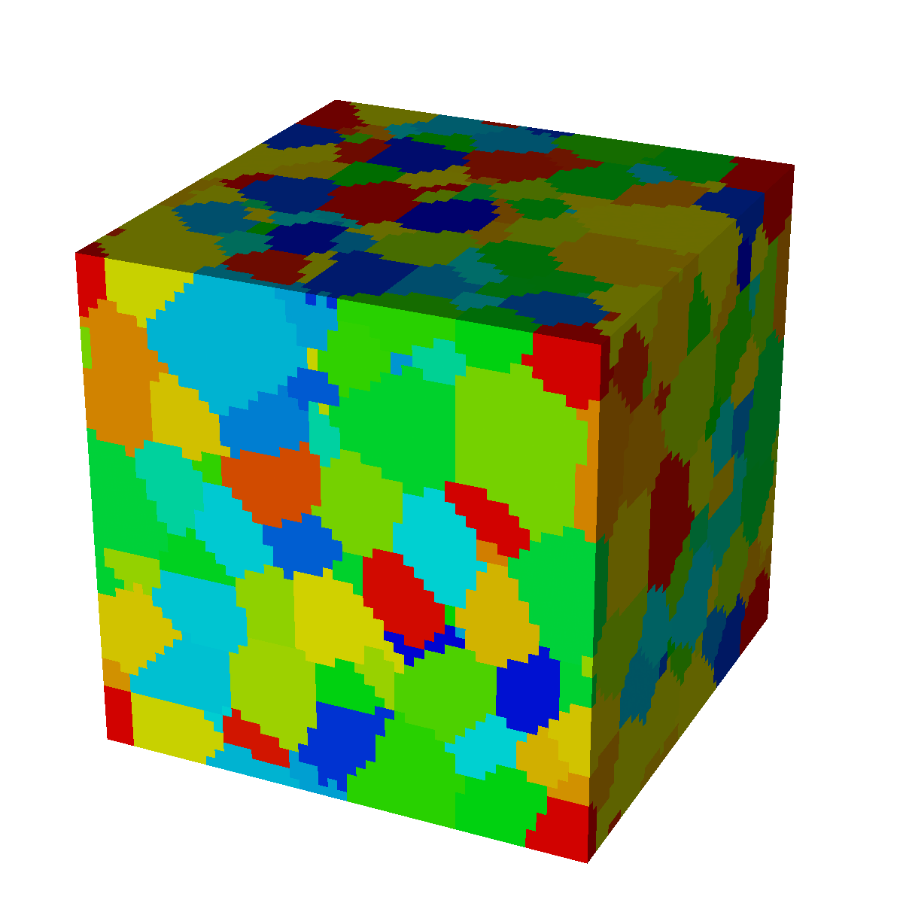
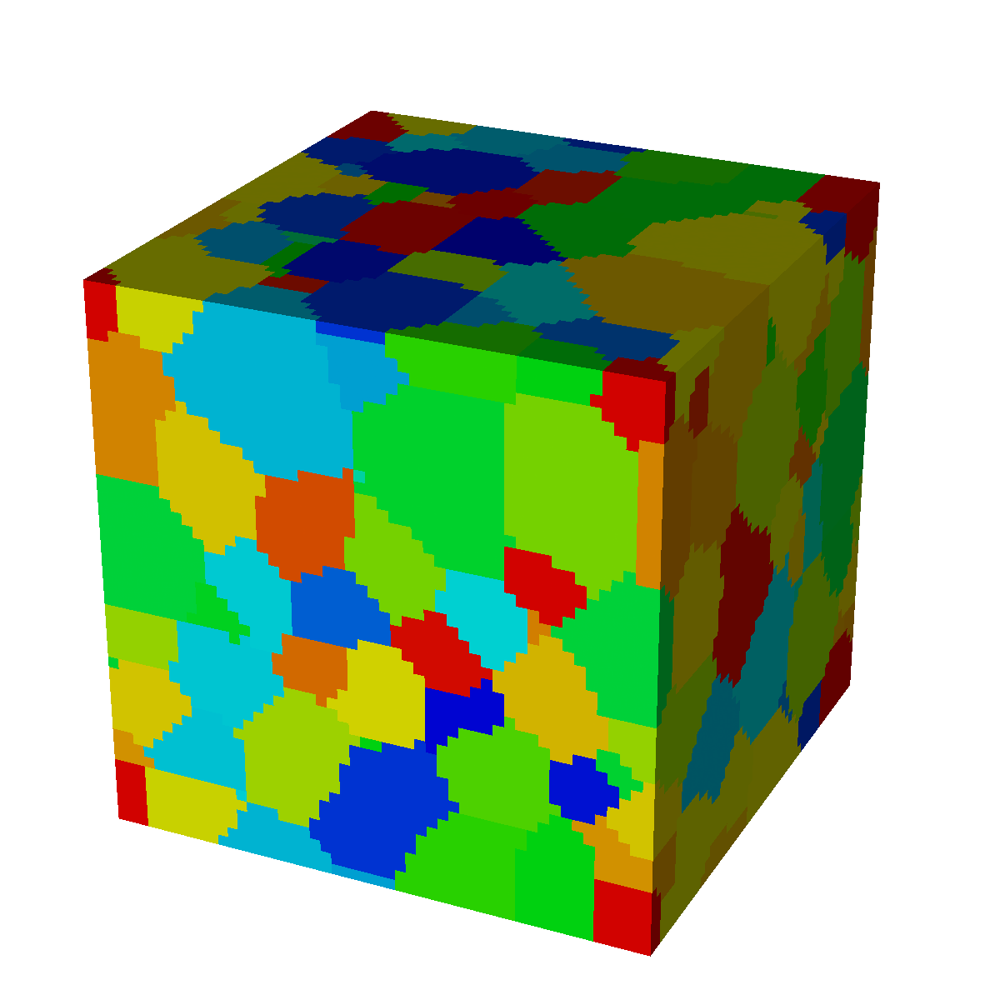

# Potts Monte Carlo Model

Potts monte carlo models can be used in a computer simulation of microstructure evolution. One example is grain growth. This repository contains several codes (some test codes written in Matlab, and more advanced codes written in C++) to explore the method, learn about its capabilities and have tools ready to study the relevant physical phenomena. 

Great source of reference for beginners is the publication by Holm and Battaile (https://doi.org/10.1007/s11837-001-0063-2).

Example of normal grain growth with 50x50x50 cells using the provided C++ code:

0000                         | 0050                        | 0250                        | 0350
:---------------------------:|:---------------------------:|:---------------------------:|:---------------------------:
  |  |  | 

In the table above, each color represents a unique state = grain orientation. 
